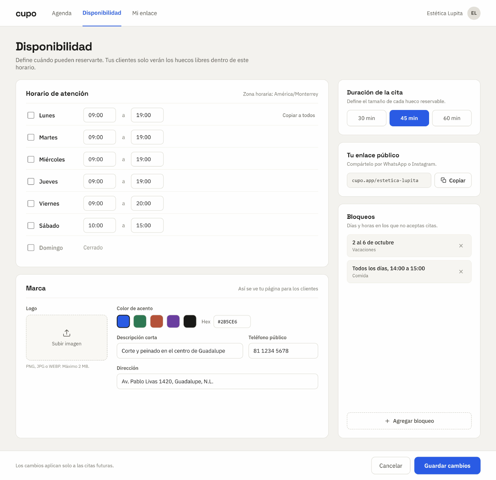
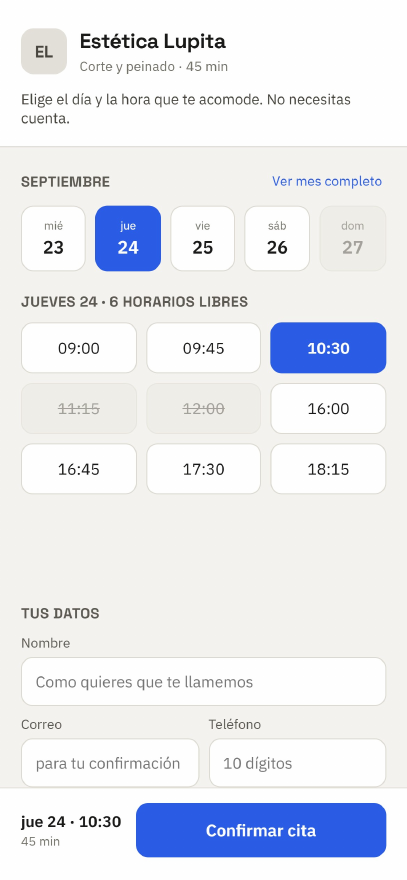
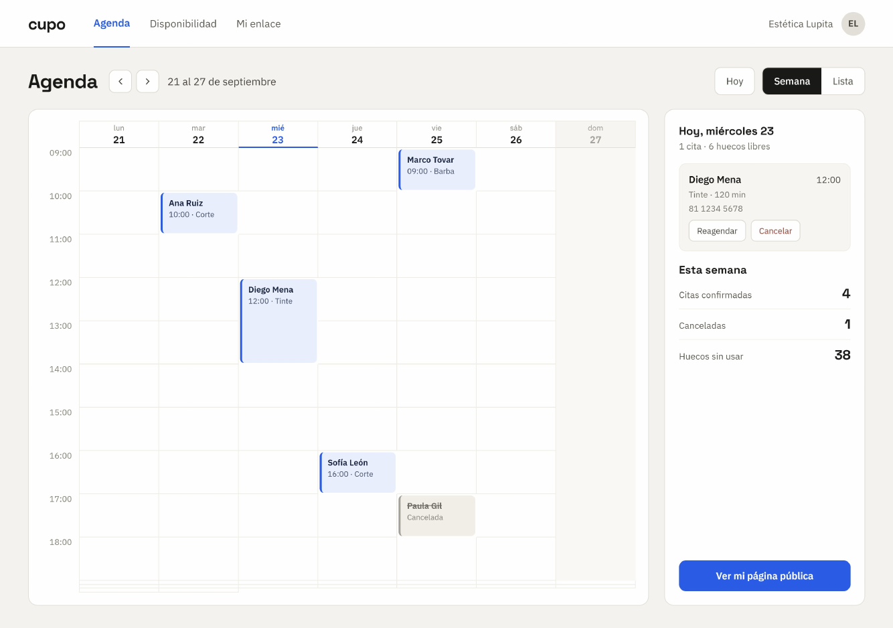
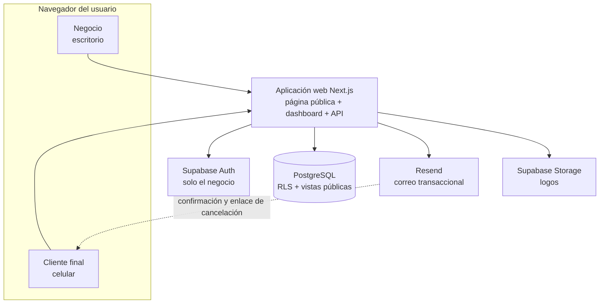
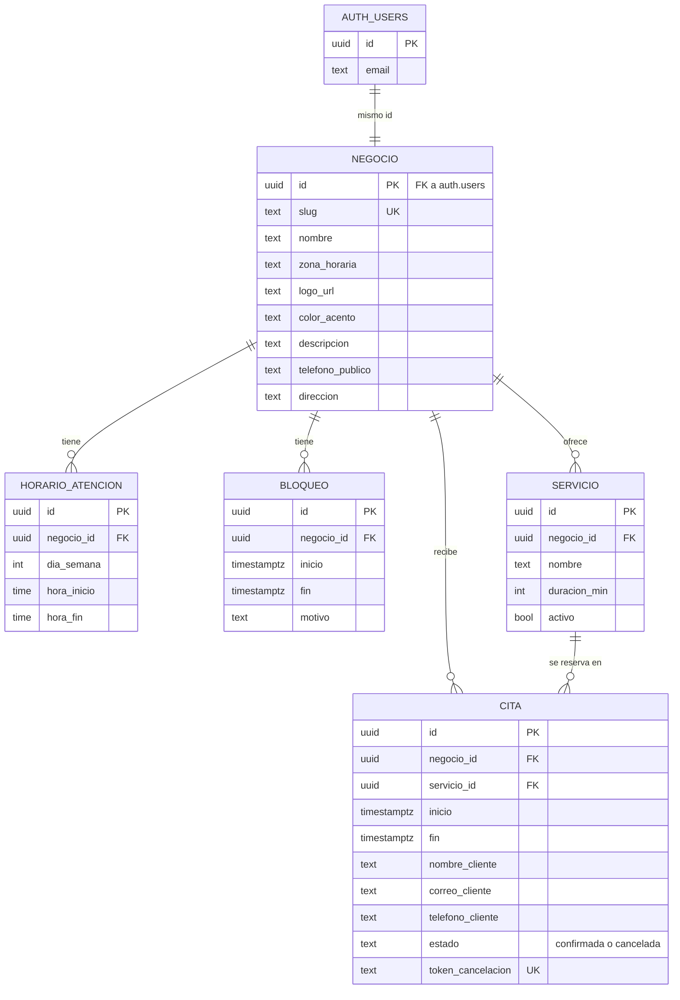

# Cupo

**Agenda de citas por enlace para negocios de servicio pequeños.** El negocio comparte un link, el cliente elige un horario libre y la cita aparece en el calendario del negocio sin que nadie escriba un mensaje.

> Comparte un link, deja de contestar mensajes.

| | |
| --- | --- |
| **Colaboradores** | [@arthurtoast](https://github.com/arthurtoast) · [@data584](https://github.com/data584) |
| **Estado** | Sprint 0 (Discovery) |
| **Backlog** | [Issues](../../issues) · Project "Cupo — Backlog" |

## Documentación

- [Wireframes de las 3 pantallas clave](#pantallas-clave)
- [Historias de usuario](../../issues): las 15 historias del MVP, con criterios de aceptación, como Issues

## El problema

El negocio de una a cinco personas agenda por WhatsApp y cada cita cuesta de tres a seis mensajes. Eso le quita tiempo al dueño, produce dobles reservas, deja huecos vacíos cuando alguien no avisa que no va y pierde clientes que escriben fuera de horario. Las herramientas que existen (Calendly, Booksy, AgendaPro, Doctoralia) son caras o pesadas de configurar para ese tamaño de negocio.

## Alcance del MVP

El ciclo completo de una cita: el negocio publica su disponibilidad, un desconocido reserva desde el link y ambos quedan notificados.

- Registro e inicio de sesión del negocio
- Horario de atención por día, duración estándar de la cita y bloqueos
- Marca propia: logo, color de acento, descripción y datos de contacto
- Página pública de reserva por negocio
- Reserva con nombre, correo y teléfono, **sin cuenta para el cliente**
- Correo de confirmación al cliente, con enlace único para cancelar, y aviso al negocio
- Dashboard con calendario y lista de citas; cancelación por parte del negocio

**Criterio de terminado:** una persona ajena al equipo, sin instrucciones y desde su celular, abre el link, reserva, recibe el correo y la cita aparece en el dashboard del negocio.

## Pantallas clave

| Disponibilidad y marca | Página pública | Agenda |
| --- | --- | --- |
|  |  |  |

## Arquitectura

Aplicación web **monolítica** con base de datos relacional. No hay microservicios, colas ni cachés: el volumen esperado (5 a 30 citas por semana por negocio) no los justifica.

**Quién puede hacer qué:**

- **Negocio** (con sesión de Supabase Auth): lee y modifica solo sus propias filas, impuesto con Row Level Security.
- **Cliente final** (sin cuenta): lee la marca y los horarios libres desde vistas públicas que nunca exponen datos de otros clientes. Reserva y cancela solo a través de dos funciones de la base, `reservar_cita` y `cancelar_por_token`.
- **Doble reserva:** la impide una restricción de exclusión en la base (`tstzrange(inicio, fin) with &&`), no el código de la aplicación.

### Stack

| Capa | Herramienta |
| --- | --- |
| Frontend y backend | Next.js con React y TypeScript |
| Base de datos | PostgreSQL (Supabase) |
| Autenticación | Supabase Auth (solo el negocio) |
| Archivos | Supabase Storage |
| Calendario | FullCalendar |
| Correo | Resend |
| Despliegue | Vercel + Supabase |
| Backlog | GitHub Issues + GitHub Projects |

## Modelo de datos

La cita guarda una copia de los datos del cliente porque el cliente no tiene cuenta. Todas las fechas se guardan en UTC y se muestran en la zona horaria del negocio.

## Calendario

| Hito | Cierre | Objetivos |
| --- | --- | --- |
| Sprint 0 · Discovery | 27 sep | Visión del producto · Backlog inicial en GitHub · Repositorio con README · Arquitectura y modelo de datos · Wireframes de las 3 pantallas clave |
| Sprint 1 | 24 oct | Flujo principal funcionando en producción · URL pública accesible · Sprint Review documentado |
| Validación | 7 nov | Demo con usuario externo documentada · Feedback capturado como Issues · Backlog ajustado para el Sprint 2 · Retrospectiva del Sprint 1 |
| Sprint 2 | 21 nov | Historias del Sprint 2 cerradas en GitHub · Ajustes del feedback aplicados · Pruebas básicas de integración |
| Sprint 3 | 28 nov | Pruebas sobre flujos principales · Producto estable en producción · Propuesta de valor y modelo de negocio |

## Forma de trabajo

- Scrum: el backlog vive en GitHub Issues y en el Project "Cupo — Backlog", con las columnas Backlog, Sprint, En progreso y Listo.
- Las historias no se asignan de antemano a un sprint; en la planeación de cada uno se mueven de Backlog a Sprint según los objetivos del hito.
- Una rama por Issue, PR revisado por el otro integrante, merge a `main` despliega a producción.
- Cada historia se considera terminada cuando cumple sus criterios de aceptación, tiene pruebas, el CI está en verde y funciona en producción desde un celular.
